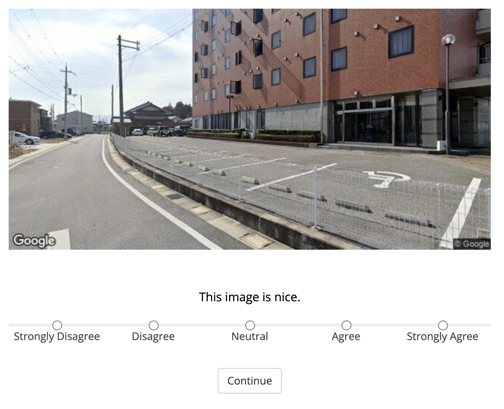

# Programming Skill Assessment for Research Assistants
## Mind in Society Lab
**Deadline:** ***Wednesday, September 14, 2022, by 11:59 PM ET***.

Assessment for `TODO: name` (`TODO: email`)

**Please make sure you read ALL instructions and complete ALL parts asked of you.**

---
## Instruction
### Part 2: Programming/Designing a Survey Block

Our lab uses a JavaScript-based package called `jsPsych` to custom build our survey studies. In this exercise, you will use the starter code provided in `index.html`, assets inside of the `assets`, and the [`jsPsych` documentation](https://www.jspsych.org/7.3/) to create a simple trial. 

**NOTE**: Look up the documentation to help you complete these tasks!

#### Task 1: Add your name to the study data
Using the `jsPsych.data.addProperties()` function, add your name to the study data in a key-value pair. Use `created_by` as the key, and your full name as the value. 

#### Task 2: Create a new trial
Use the `survey-likert` plugin on jsPsych and the image asset `test_image.jpg`, create a likert-scale trial that resembles the following:

***Hint***: You can embed the image into the `preamble` property of the trial using the `` HTML tag.

#### Task 3: Add the new trial into the timeline
To run this trial, it needs to be added into the jsPsych timeline to be excuted.

#### Task 4: Add the remote plug in script for all objects in the timeline
You will also need to load the plugin's javascript file for a plugin to work. Do so for ALL objects in the timeline. Look at the starter code + documentation to find and add what you need here.

#### Task 5: Running the task and saving the data
Open the modified `index.html` file to run the newly completed task. Select the middle option on the likert scale, then advance forward. It should prompt you to download a CSV file for the recorded data. Download the file and place it into the same directory as the `index.html` file.

---
### Make sure to commit your changes often! 
To submit, you should have a modified `index.html` file and a new CSV file added in this directory. 